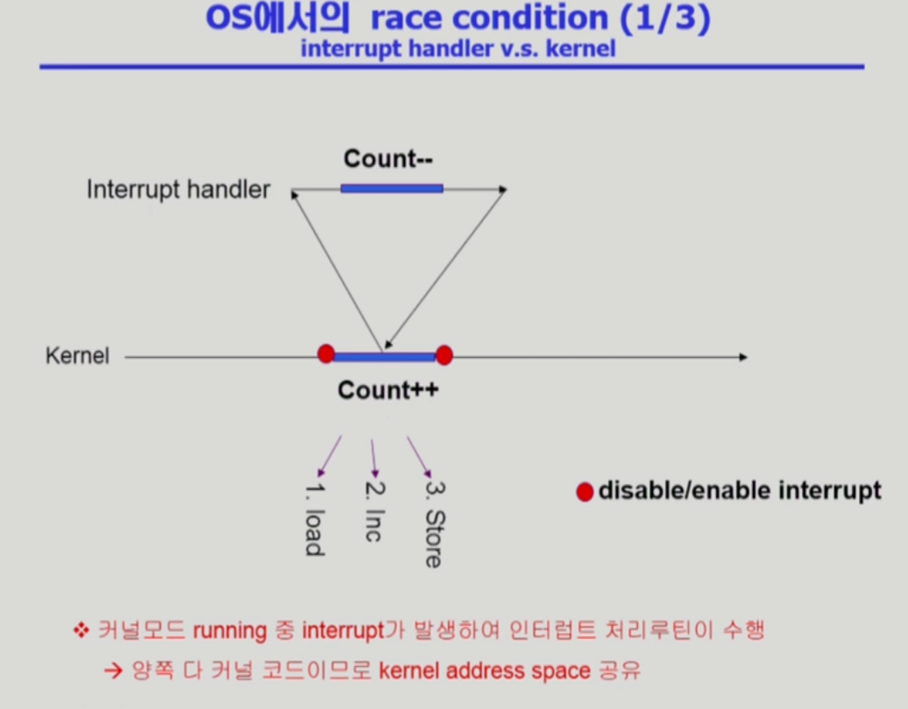
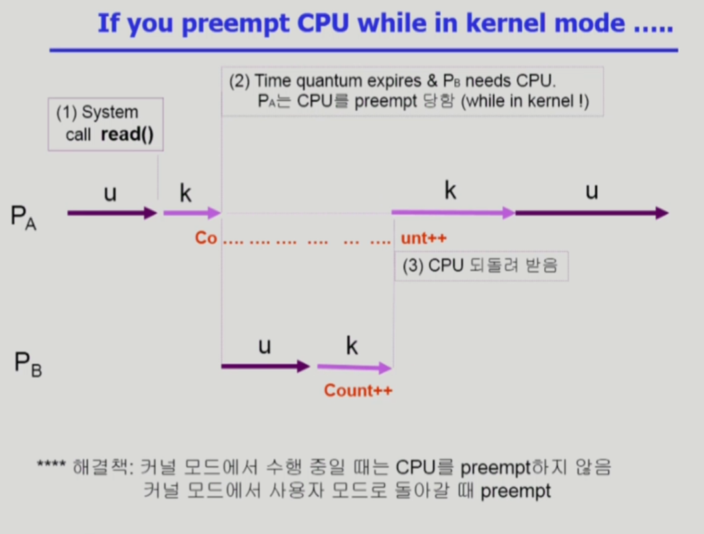
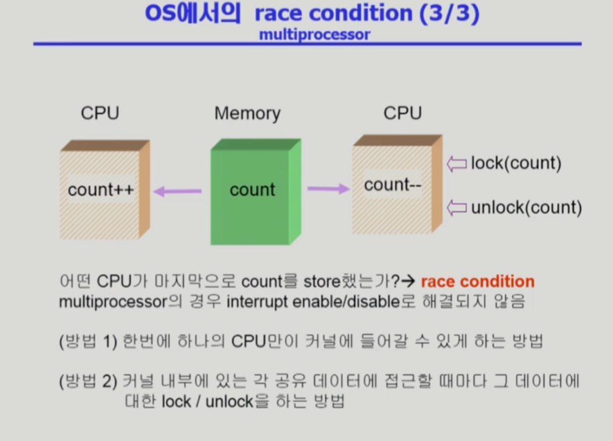
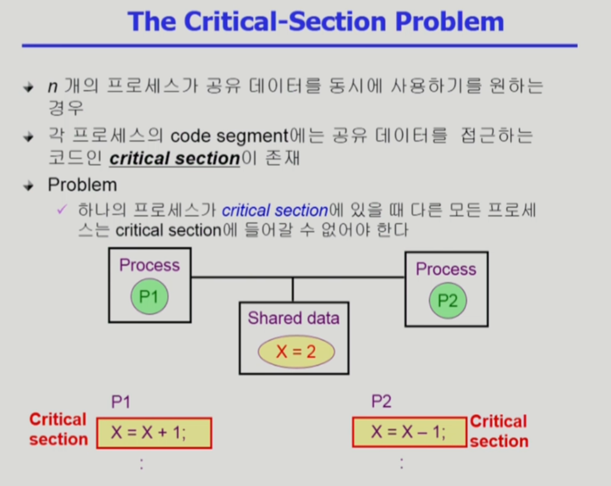
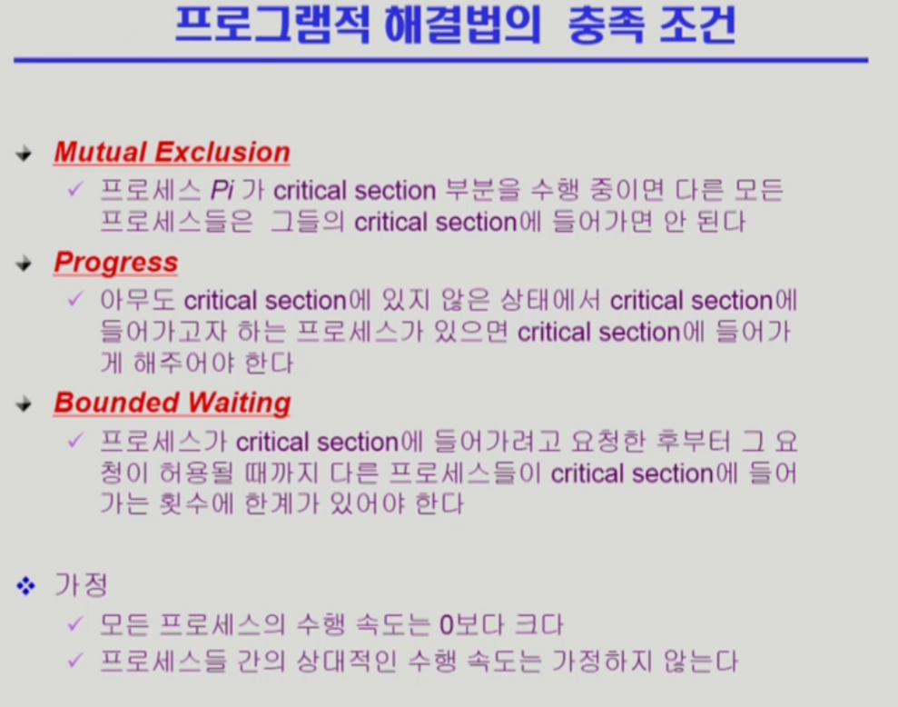

# Operating System 07 | Process Synchronization

#### Race Condition (경쟁 상태)

- Storage box를 공유하는 Execution box가 여러개 있을 경우 발생할 수 있음
- ex.
  - E-box 1은 S-box의 data를 더하는 연산을 하는 기능
  - E-box 2는 S-box의 data를 빼는 연산을 하는 기능
  - 연산 이후, 결과가 저장될 때 E-box 2의 연산 결과만 저장될 수도 있음

 

### OS에서 race condition이 언제 발생하는가?

- kernel 수행 중 인터럽트 발생 시

- Process가 System call을 하여 kernel mode로 수행 중인데 context switch가 일어나는 경우

- Multiprocessor에서 shared memory 내의 kernel data

 

### Process Synchronization 문제

- 공유 데이터(shared data)의 동시 접근(concurrent access)은 데이터의 불일치 문제(inconsistency)를 발생시킬 수 있음
- 일관성(consistency) 유지를 위해서는 협력 프로세스(Cooperating process) 간의 실행 순서(orderly execution)를 정해주는 메커니즘이 필요
- Race Condition
  - 여러 프로세스들이 동시에 공유 데이터에 접근하는 상황
  - 데이터의 최종 연산 결과는 마지막에 그 데이터를 다룬 프로세스에 따라서 달라짐
- race condition을 막기 위해서 concurrent process는 동기화(synchronize)되어야 함

 

### The Critical-Section Problem

- 각 프로세스 code segment 안에 공유 데이터에 접근하는 코드인 **critical section**이 존재

 

- 

 

> 본 내용은 이화여자대학교 반효경 교수님 운영체제 강의 내용입니다.
>
> [운영체제 | 이화여자대학교 반효경](http://www.kocw.net/home/search/kemView.do?kemId=1046323)

